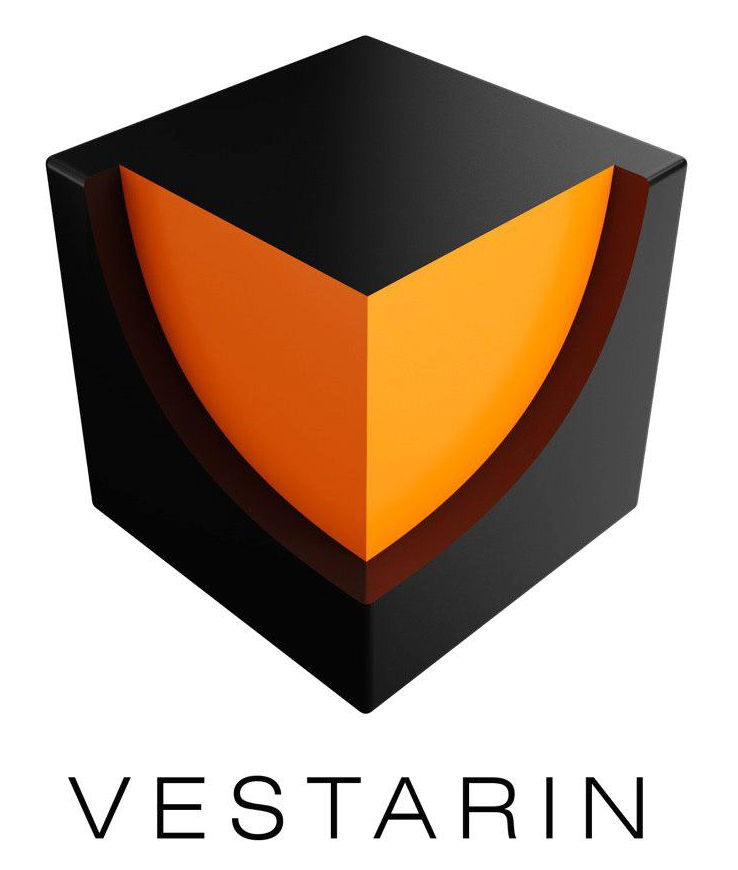

  <h1> Vestarin </h1>
  

* _Standart_        : ERC20
* _Name_            : Vestarin
* _Ticket_          : VST
* _Decimals_        : 18
* _Emission_        : Mintable
* _Crowdsales_      : 2
* _Fiat dependency_ : No
* _Tokens locked_   : No

## Smart-contracts description

Contract mint bounty and founders tokens after main sale stage finished. 
Crowdsale contracts have special function to retrieve transferred in errors tokens.

### Contracts contains
1. _VestarinToken_ - Token contract
2. _Presale_ - Presale contract
3. _Mainsale_ - ICO contract
4. _Configurator_ - contract with main configuration for production

### How to manage contract
To start working with contract you should follow next steps:
1. Compile it in Remix with enamble optimization flag and compiler 0.4.18
2. Deploy bytecode with MyEtherWallet. Gas 5100000 (actually 5073514).
3. Call 'deploy' function on addres from (3). Gas 4000000 (actually 3979551). 

Contract manager must call finishMinting after each crowdsale milestone! 

### How to invest
To purchase tokens investor should send ETH (more than minimum 0.1 EHT) to corresponding crowdsale contract.
Recommended GAS: 250000, GAS PRICE - 21 Gwei.

### Wallets with ERC20 support
1. MyEtherWallet - https://www.myetherwallet.com/
2. Parity 
3. Mist/Ethereum wallet

EXODUS not support ERC20, but have way to export key into MyEtherWallet - http://support.exodus.io/article/128-how-do-i-receive-unsupported-erc20-tokens

Investor must not use other wallets, coinmarkets or stocks. Can lose money.

## Token counts

Maximum tokens can mint - 20 000 000 VST 
* on all crowdsales : 82% or 16 500 000 VST 
** on presale : 7% or 1 500 000 VST 
** on mainsale : 75% or 15 000 000 VST
* to founders : 13% or 2 500 000 VST
* to bounty : 5% or 1 000 000 VST

## Main network configuration

* _Minimal insvested limit_     : 0.1 ETH
* _Bounty tokens percent_       : 5% of Presale tokens
* _Founders tokens percent_     : 13% of Presale tokens
* _For sale tokens percent_     : 82% of Presale tokens
* _Founders tokens wallet_      : 
* _Bounty tokens wallet_        :
* _Founders tokens lock period_ : 90 days

### Links
1. _Token_ - 
2. _Presale_ - 
3. _Mainsale_ - 

### Crowdsale stages

#### Presale
* _Hardcap_                    : 5000 ETH
* _Price_                      : 300 VST
* _Period_                     : 30 days
* _Start_                      : 30.01.2018 01:00 GMT
* _Master wallet_              : 
* _Slave wallet_               : 
* _Master wallet percent_      : 70%
* _Slave wallet percent_       : 30%
* _Contract owner_             : 

#### ICO
* _Hardcap_                    : 100000 ETH
* _Period_                     : 30 days
* _Start_                      : 05.03.2018 01:00 GMT
* _Master wallet_              : 
* _Slave wallet_               : 
* _Master wallet percent_      : 70%
* _Slave wallet percent_       : 30%
* _Contract owner_             : 

_Milestones_
1. hardcap  5000 ETH, price 200 per ETH
2. hardcap  5000 ETH, price 180 per ETH
3. hardcap 10000 ETH, price 170 per ETH
4. hardcap 20000 ETH, price 160 per ETH
5. hardcap 20000 ETH, price 150 per ETH
6. hardcap 40000 ETH, price 130 per ETH

## Kovan network configuration

* _Minimal insvested limit_     : 0.1 ETH
* _Bounty tokens percent_       : 5% of Presale tokens
* _Founders tokens percent_     : 13% of Presale tokens
* _For sale tokens percent_     : 82% of Presale tokens
* _Founders tokens wallet_      : 0x67d78DE2f2819dcBd47426A1ac6a23B9e9C9d300
* _Bounty tokens wallet_        : 0x772215cCF488031991f7DCC65e80A7C1FD497E75
* _Founders tokens lock period_ : 2 days

### Links
1. _Token_ - https://kovan.etherscan.io/token/0x1c71b977b7908f5853e082cfae8ac217fc6dd5bc#balances
2. _Presale_ - https://kovan.etherscan.io/address/0xc2c7fe44315113f315cf74ce5578f9c0bd910e62#readContract
3. _Mainsale_ - https://kovan.etherscan.io/address/0x707c932105e9bc515ecfcb43673dde4ec70841fa#readContract 

### Crowdsale stages

#### Presale
* _Hardcap_                    : 5 ETH
* _Price_                      : 300 VST
* _Period_                     : 30 days
* _Start_                      : 12.11.2017 00:00 GMT
* _Master wallet_              : 0x66fF3b89e15ACB0B5e69179a2e54c494b89bdB1B
* _Slave wallet_               : 0x54a67F1507dEb1BFc58ba3ffa94B59fC50EB74BC
* _Master wallet percent_      : 70%
* _Slave wallet percent_       : 30%
* _Contract owner_             : 0x445c94f566abF8E28739c474c572D356d03Ad999

#### ICO
* _Hardcap_                    : 3 ETH
* _Period_                     : 30 days
* _Start_                      : 13.11.2017 13:00:00 GMT
* _Master wallet_              : 0xD1BC33B2c89C93E65b0D476B8b50BFee82594847
* _Slave wallet_               : 0xE619BCD3c4609AE269B5eBE5bf0cb7D1Dc70C210
* _Master wallet percent_      : 70%
* _Slave wallet percent_       : 30%
* _Contract owner_             : 0x445c94f566abF8E28739c474c572D356d03Ad999

_Milestones_
1. hardcap 1 ETH, price 200 per ETH
2. hardcap 2 ETH, price 100 per ETH

### Test audit

## Investors

### Presale
* _0x4755815de8906C49b05705a06e8788bfE3bCaa33_ - 0.1 ETH invested => 30 VST tokens, transaction: https://kovan.etherscan.io/tx/0xca5e12e1f1c22270cbf02d59258fa36cf43eac75e25c88798b44719dd80e8752, 0.07 ETH => to master wallet, 0.03 to slave wallet
* _0xb8600b335332724Df5108Fc0595002409c2ADbC6_ - 1.12 ETH invested => 336 VST tokens, https://kovan.etherscan.io/tx/0x0d981d4d59adb076a4638aac73f34a6d9311e1bc38130b711b2b7f7c27c056e2, 0.784 ETH => to master wallet, 0.336 to slave wallet

## Transfer tokens transactions
1. From presale investor 0x4755815de8906C49b05705a06e8788bfE3bCaa33 to 0x1c71b977B7908f5853E082Cfae8aC217Fc6Dd5Bc transfer 10 tokens: https://kovan.etherscan.io/tx/0x0d981d4d59adb076a4638aac73f34a6d9311e1bc38130b711b2b7f7c27c056e2
 

